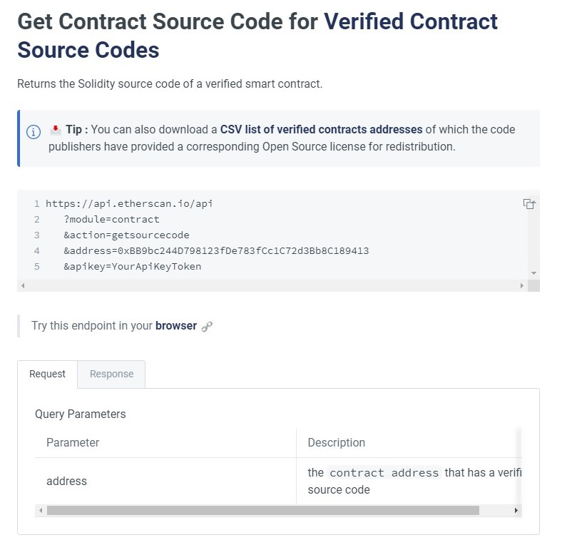

# demo
Description: Get the verified contract on the eth chain

## Directory Description
data folder: Save data files. Subfolders under this directory: bytecodes is used to save the compiled bytecode of the obtained on-chain contract, contract_address is used to save the verified contract address downloaded from etherscan, sourcecodes is used to save the obtained on-chain contract source code

docs folder: used to save related documents, styles, pictures and other resources
src folder: for saving python files

main.py: main program file
## Program Description
To obtain the source code of the contract on the chain, the api of etherscan is mainly used.

For specific instructions, please refer to [Official Instructions](https://docs.etherscan.io/api-endpoints/contracts)

To get the contract, you need to register with etherscan, get the free request ApiKey
The login link is[login](https://etherscan.io/login)

To obtain the contract source code, you need to prepare the verified contract deployment address in advance. The official download link is[open-source-contract-codes](https://etherscan.io/exportData?type=open-source-contract-codes)

To get the deployed binaries, you can use web3.py, the official development documentation link is[web3.py](https://web3py.readthedocs.io/en/stable/web3.eth.html?highlight=eth_getCode#web3.eth.Eth.getCode)

## Operating Instructions

### operating environment
The running environment is python 3.7.9

### Install dependent libraries
```
pip install -r requirements.txt  
```

### Set apikey in main.py and run the main program
```
python main.py
```

